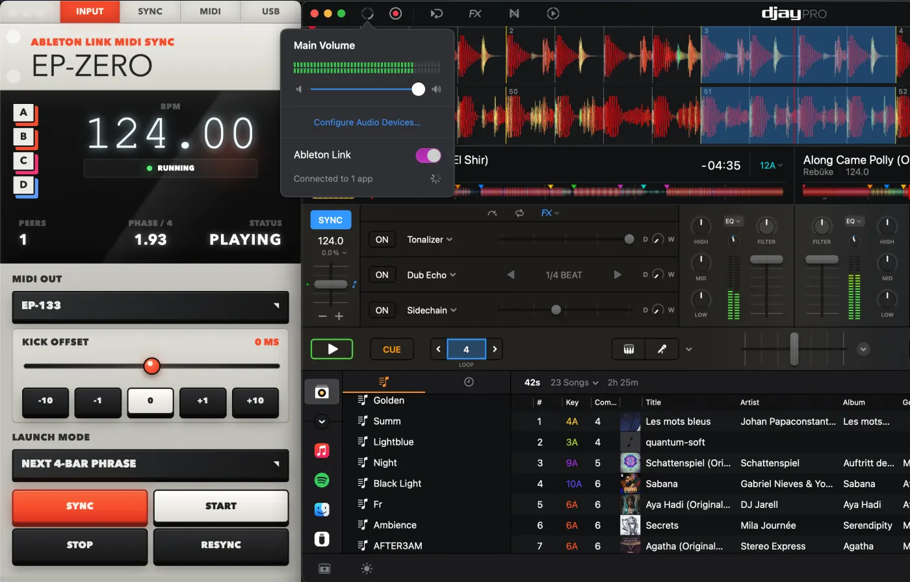

# EP-ZERO

EP-ZERO is a lightweight macOS Electron app that turns an Ableton Link session into USB MIDI Clock and transport for external gear.

```text
Ableton Link source -> EP-ZERO -> USB MIDI Clock + Start/Stop -> USB MIDI device
```

The interface is visually inspired by the Teenage Engineering EP-133 KO II. It is not an official Teenage Engineering product.



## Tested With

- djay Pro as an Ableton Link source.
- Teenage Engineering EP-133 KO II over USB MIDI Clock.
- Ableton Move through Ableton Link sync.
- Novation Circuit Rhythm over USB MIDI Clock.

Ableton Move sync is handled through Link, not by forcing the visible Move USB MIDI ports.

## Features

- Reads Ableton Link BPM, beat, phase, peer count and play state.
- Sends MIDI Timing Clock at 24 PPQN to a selected USB MIDI output.
- Sends MIDI Start and Stop transport messages.
- Schedules sync on the next beat, bar or 4-bar phrase.
- Provides `SYNC`, `START`, `STOP` and `RESYNC` controls for live use.
- Supports kick offset calibration from `-250 ms` to `+250 ms`.
- Persists the selected MIDI output, launch mode and offset settings.

## Setup

```bash
pnpm install
pnpm run dev
```

Native MIDI and Ableton Link bindings are required for the real bridge path. If the app reports a native binding warning, rebuild them:

```bash
pnpm run rebuild:native
```

Open the Electron app for hardware testing. The browser preview cannot access the same desktop MIDI and preload path.

## USB MIDI Setup

Set the receiving device to receive MIDI Clock over USB. EP-ZERO should be the clock sender; the external device should not be configured as the clock source.

## Export A macOS App

To build a local `.app`:

```bash
pnpm run dist:mac
```

The script builds the renderer/main process, rebuilds native modules for Electron, packages with electron-builder, and copies `EP-ZERO.app` to the project root. The staged build also remains under `release/mac-arm64/`.

To build a DMG instead:

```bash
pnpm run dist:dmg
```

## Verification

```bash
pnpm test
pnpm run build
```
